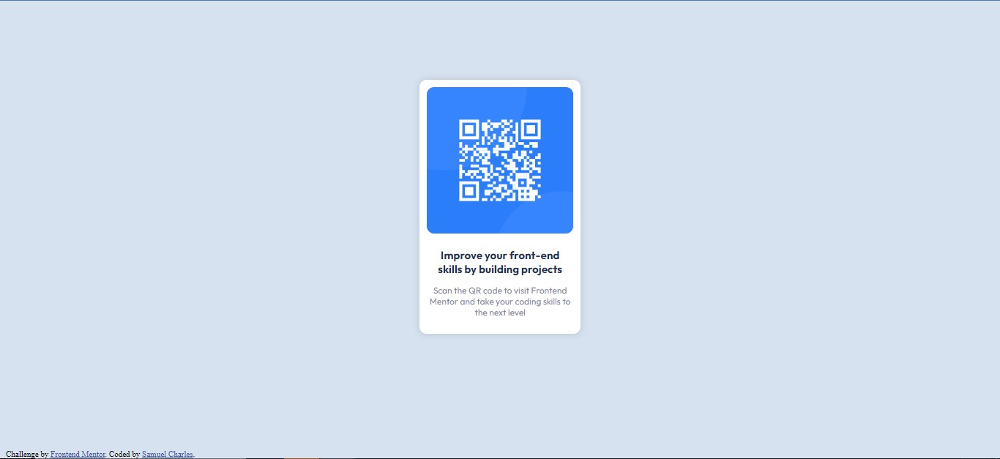

# Frontend Mentor - QR code component solution

This is a solution to the [QR code component challenge on Frontend Mentor](https://www.frontendmentor.io/solutions/i-mainly-used-flexbox-since-i-am-comfortable-with-it-_wk6Mni8tK). I mainly used flex-box cause I feel comfortable with it.

## Table of contents

- [Overview](#overview)
  - [Screenshot](#screenshot)
  - [Links](#links)
- [My process](#my-process)
  - [Built with](#built-with)
  - [What I learned](#what-i-learned)
- [Author](#author)

**Note: Delete this note and update the table of contents based on what sections you keep.**

## Overview

### Screenshot



### Links

- Solution URL: [Click here](https://github.com/Samuel8946/Frontend-Mentor-Challenges/blob/main/8.3%2BMedia%2BQuery/qr-code-component-main/index.html)

- Live Site URL: [Click here for preview](https://samuel8946.github.io/Frontend-Mentor-Challenges/8.3+Media+Query/qr-code-component-main/)

## My process

I've been doing havard's CS50 for a while and learned how to break down big problems into small one and if that wasn't
enough break it down even more so, before I started coding I needed to know what the whole project was made up of.

### Built with

- Semantic HTML5 markup
- CSS custom properties
- Flexbox

### What I learned

So starting from the background all the way to the center of the website understanding that making an outer container
which is now display flex I can just use both justify-content and align-items to easily center the div in the 
center of the page.

```html
<div class="outer-container">
```

```css
    .outer-container {
      display: flex;
      align-items: center;
      justify-content: center;
    }
```
^^^

Now all that left is to target the div decendant of the outer-container and make that also flex but with the main axis being column with flex-direction column and centering all the children and using text-align center on the <p> elements.
The rest is just adding colors and changing font weigh, size, family etc. One final thing I add shadow aroung the div using box shadow.


## Author

- Frontend Mentor - [@Samuel8946](https://www.frontendmentor.io/profile/Samuel8946)
- Instagram - [samuel4eaphy](https://www.instagram.com/samuel4eaphy/)

